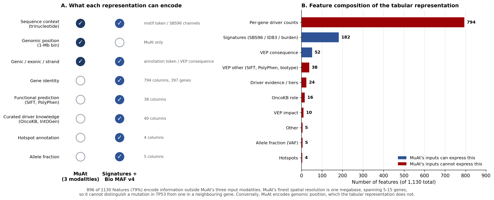

# Results Summary

**Vijay Vankadaru | 5 September 2026 | branch `codex/coxnet-muat-manuscript-updates`**

Everything produced since the 1 August meeting. All numbers come from a **clean rebuild**: the
previous results table and fold checkpoints were archived first, so no row was reused from the
June run. **96 of 96** endpoint × representation × learner slots completed.

**Contents**

1. [What is new since the manuscript draft](#1-what-is-new-since-the-manuscript-draft)
2. [Main panel results](#2-main-panel-results)
3. [MuAt comparison](#3-muat-comparison)
4. [New analysis: survival vs cancer type](#4-new-analysis-survival-vs-cancer-type)
5. [New analysis: individual-feature selection](#5-new-analysis-individual-feature-selection)
6. [New analysis: SHAP attribution](#6-new-analysis-shap-attribution)
7. [New analysis: HRD shortcut ablation](#7-new-analysis-hrd-shortcut-ablation)
8. [Frozen models for external validation](#8-frozen-models-for-external-validation)
9. [Defects found and fixed](#9-defects-found-and-fixed)
10. [Reproducibility findings](#10-reproducibility-findings)
11. [Every experiment run](#11-every-experiment-run)
12. [Decisions needed](#12-decisions-needed)
13. [Files produced](#13-files-produced)

---

## 1. What is new since the manuscript draft

| # | New work | Type |
|---|---|---|
| 1 | Full benchmark rerun from clean state, all 96 slots | Rerun |
| 2 | Cancer-type survival baseline (Jeya's request) | New analysis |
| 3 | Individual-feature selection inside Bio MAF v4 (Jeya's protocol) | New analysis |
| 4 | SHAP attribution, aggregated to annotation blocks | New analysis |
| 5 | HRD shortcut ablation: HRR-gene and VAF knockouts | New analysis |
| 6 | MuAt four-arm fidelity ablation | New analysis |
| 7 | MuAt on `cancer_type_top20` vs the published number | New result |
| 8 | Four frozen models for external validation | New artefact |
| 9 | Seven code defects found and fixed | Correctness |
| 10 | Four missing files identified in the published data bundle | Reproducibility |

---

## 2. Main panel results

Nested out-of-fold, five outer folds, pooled predictions. Best score per cell.

### 2.1 Summary - best learner per representation

| Endpoint | Metric | n | Burden | Signatures | Bio MAF v4 | Sigs + Bio MAF | Best |
|---|---|---|---|---|---|---|---|
| Kucab damage class | balanced acc | 259 | 0.178 | **0.331** | 0.293 | 0.204 | Signatures |
| HRD score | Spearman r | 772 | 0.600 | 0.693 | 0.741 | **0.767** | Combined |
| HRD24 high/low | AUROC | 772 | 0.775 | 0.829 | 0.832 | **0.848** | Combined |
| HRD33 high/low | AUROC | 772 | 0.799 | 0.850 | 0.856 | **0.901** | Combined |
| HRD42 high/low | AUROC | 772 | 0.838 | **0.902** | 0.875 | 0.897 | Signatures |
| Cancer type (top 20) | balanced acc | 8,800 | 0.255 | 0.538 | 0.662 | **0.738** | Combined |
| Overall survival | Harrell C | 9,986 | 0.584 | 0.607 | 0.634 | **0.650** | Combined |
| PFI | Harrell C | 9,857 | 0.555 | 0.570 | 0.622 | **0.630** | Combined |

> **Meaning.** No representation wins everywhere. Signatures win the mechanistic endpoint;
> combined signature + annotation features win tumour identity and HRD. The spread across
> representations far exceeds the spread across learners - the paper's central claim.

### 2.2 Full detail - by learner

| Endpoint | Representation | Linear | XGBoost |
|---|---|---|---|
| **damage_class** (bal. acc) | burden | 0.1783 | 0.1446 |
| | signatures | **0.3309** | 0.2500 |
| | Bio MAF v4 | 0.2934 | 0.1744 |
| | sigs + Bio MAF | 0.2042 | 0.1982 |
| **HRD_Score** (Spearman) | burden | 0.4973 | 0.5997 |
| | signatures | 0.4306 | 0.6927 |
| | Bio MAF v4 | 0.7144 | 0.7413 |
| | sigs + Bio MAF | 0.7325 | **0.7666** |
| **hrd_binary_24** (AUROC) | burden | 0.7504 | 0.7749 |
| | signatures | 0.7577 | 0.8292 |
| | Bio MAF v4 | 0.7805 | 0.8315 |
| | sigs + Bio MAF | 0.8112 | **0.8478** |
| **hrd_binary_33** (AUROC) | burden | 0.7884 | 0.7989 |
| | signatures | 0.7736 | 0.8496 |
| | Bio MAF v4 | 0.7691 | 0.8555 |
| | sigs + Bio MAF | 0.7965 | **0.9008** |
| **hrd_binary_42** (AUROC) | burden | 0.8245 | 0.8383 |
| | signatures | 0.8585 | **0.9024** |
| | Bio MAF v4 | 0.7911 | 0.8746 |
| | sigs + Bio MAF | 0.8245 | 0.8970 |
| **cancer_type_top20** (bal. acc) | burden | 0.2473 | 0.2549 |
| | signatures | 0.5263 | 0.5381 |
| | Bio MAF v4 | 0.5712 | 0.6618 |
| | sigs + Bio MAF | 0.6723 | **0.7378** |
| **OS** (Harrell C, CoxNet) | burden | 0.5838 | - |
| | signatures | 0.6069 | - |
| | Bio MAF v4 | 0.6335 | - |
| | sigs + Bio MAF | **0.6505** | - |
| **PFI** (Harrell C, CoxNet) | burden | 0.5552 | - |
| | signatures | 0.5697 | - |
| | Bio MAF v4 | 0.6220 | - |
| | sigs + Bio MAF | **0.6305** | - |

### 2.3 Change from the submitted draft

| Endpoint | Representation | New | Draft | Δ |
|---|---|---|---|---|
| OS | sigs + Bio MAF | 0.6505 | 0.647 | +0.003 |
| OS | Bio MAF v4 | 0.6335 | 0.632 | +0.002 |
| PFI | sigs + Bio MAF | 0.6305 | 0.614 | +0.016 |
| PFI | Bio MAF v4 | 0.6220 | 0.606 | +0.016 |

> **Meaning.** Survival numbers barely moved despite the CoxNet fix, so the survival finding in
> §4 is not an artefact of the older code. Two housekeeping issues also resolved: `damage_class`
> now reports balanced accuracy (matching Table 1, previously macro-AUROC), and Table S3 now
> reports **zero** unmeasured combinations where the draft listed five families with none.

---

## 3. MuAt comparison

### 3.1 On MuAt's own benchmark - TCGA-WES, 20 tumour types

| Model | Accuracy | Top-5 | Balanced acc | n |
|---|---|---|---|---|
| **Signatures + Bio MAF v4 / XGBoost** | **0.744** | **0.955** | 0.738 | 8,800 |
| MuAt, published (Sanjaya et al. 2023) | 0.641 | 0.906 | - | 7,352 |
| MuAt-compatible, after fixes | 0.570 | 0.871 | 0.550 | 8,800 |
| MuAt-compatible, before fixes | 0.539 | 0.861 | 0.534 | 8,800 |

> **Meaning.** The tabular representation beats the published MuAt number by 0.103 accuracy on
> MuAt's own task - a like-for-like comparison that does not depend on our reimplementation. Our
> reimplementation gained **+0.031** from the fidelity fixes and remains 0.071 below the published
> figure; the residual gap is attributed in §3.3.

### 3.2 Fidelity ablation on the HRD endpoints

Each arm adds one fidelity fix. Identical folds and seed.

| Arm | Change introduced | HRD_Score (Spearman) | HRD33 (AUROC) |
|---|---|---|---|
| A | as committed (training-budget bug, hashed dictionaries) | 0.4766 | 0.7582 |
| B | + epoch-budget fix | 0.5032 | 0.7274 |
| C | + exact token dictionaries | 0.5041 | 0.7028 |
| D | + MuAt-faithful motif grammar and transcriptional strand | 0.4815 | 0.7335 |
| - | *tuned tabular baseline* | *0.7666* | *0.9008* |
| | **spread across arms** | **0.028** | **0.055** |

> **Meaning.** Progressive fidelity fixes changed HRD performance by less than fold-to-fold
> variance, and inconsistently in direction. The conclusion that a tuned tabular representation
> outperforms the mutation-attention model on HRD is therefore not an artefact of an unfaithful
> reimplementation. The same fixes gained +0.031 on cancer type (n = 8,800) - HRD is data-limited
> (n = 772; given a 150-epoch budget the model selects stopping epochs of 1-34), not
> representation-limited.

### 3.3 Why MuAt underperforms - input representation, not architecture



*Figure: `results/figures/figure_S_representation_comparison.png`. Panel A, what each
representation can encode. Panel B, the 1,130-feature composition split by whether MuAt's three
input modalities could express the same information. Note that feature counts and token
vocabularies are not the same unit - MuAt's motif vocabulary is far larger than 96 SBS channels -
so the comparison is about what information is expressible, not how many numbers each model sees.*


| Input | MuAt | Signatures + Bio MAF v4 |
|---|---|---|
| Unit of input | one row per mutation (variable-length bag) | one fixed vector per tumour |
| Sequence context | trinucleotide motif token | SBS96 / ID83 channels (182) |
| Genomic position | 1-Mb bin (3,116 tokens) | - |
| **Gene identity** | **none** | **794 columns, 397 genes** |
| Functional prediction (SIFT, PolyPhen, VEP impact) | none | 100 |
| Curated cancer-gene knowledge (OncoKB, IntOGen, hotspots) | none | 44 |
| Allele fraction | none | 5 |
| Genic / exonic / strand | 18 tokens | within VEP consequence |
| Aggregation | learned, via attention | pre-computed |

> **Meaning.** MuAt's finest spatial resolution is one megabase, spanning 5-15 genes, so it cannot
> distinguish "TP53 mutated" from "a neighbouring gene mutated". 84% of the Bio MAF v4 feature
> space is per-gene, and SHAP confirms the model uses it (TP53, PTEN, IDH1, APC, VHL all in the
> top 20). The claim is therefore not "our model family is better" but "this representation
> encodes gene-level and curated biology that the attention model's inputs cannot express".

### 3.4 Documented deviations from the source paper

| Deviation | Effect on our number |
|---|---|
| Architecture ranked on a short budget; MuAt trained every candidate to completion per fold | Our search selected embedding 128 on every fold; MuAt's published model was embedding 512, 2 layers |
| No ensembling; MuAt summed logits across its ten fold models | Depresses our score; ours is the stricter protocol |
| Nested 5-fold vs MuAt's non-nested 10-fold | Depresses our score; ours is the stricter protocol |
| No SV/MEI modalities | Not supplied by whole-exome data |
| Pooling unverified - the paper does not specify how mutation features are pooled | Attention-weighted set pooling is **our** design choice and should not be attributed to the source paper |

---

## 4. New analysis: survival vs cancer type

Requested by Jeya. Three CoxNet arms on TCGA CDR overall survival, **identical outer folds**,
cohort = survival and cancer type and Bio MAF v4, n = 9,986, 3,061 events.

| Arm | Features | C-index |
|---|---|---|
| Cancer type only (one-hot, 33 types) | 33 | **0.7416** |
| Bio MAF v4 only | 948 | 0.6377 |
| Cancer type + Bio MAF v4 | 981 | **0.7429** |

Paired bootstrap, 2,000 resamples:

| Comparison | Δ C-index | 95% CI | p |
|---|---|---|---|
| Bio MAF v4 vs cancer type | -0.1039 | [-0.1153, -0.0923] | 0.000 |
| **Cancer type + Bio MAF vs cancer type** | **+0.0013** | **[-0.0028, +0.0054]** | **0.512** |
| Cancer type + Bio MAF vs Bio MAF | +0.1052 | [+0.0952, +0.1150] | 0.000 |

> **Meaning.** Adding 948 genomic features to cancer type buys +0.0013 C-index. The interval
> excludes any effect above ~0.005, so this is a precise null. Cancer type alone *outperforms* the
> genomic representation by 0.10. The survival signal in Bio MAF v4 is tumour type, recovered
> imperfectly. **The survival endpoint should be reframed as a negative result.**

---

## 5. New analysis: individual-feature selection

Jeya's protocol: 80/20 split -> k-fold internal CV over six sparsity settings -> select the
sparsest setting within tolerance of the best inner score -> refit on the full training partition ->
evaluate once on the held-out 20%.

| Endpoint | Features kept | Inner-CV (best) | Held-out |
|---|---|---|---|
| cancer_type_top20 | **347 / 948 (36.6%)** | 0.6490 (0.6490) | 0.6968 |
| Overall survival | **92 / 948 (9.7%)** | 0.6296 (0.6391) | 0.6108 |

> **Meaning.** For cancer type the selected setting matched the best inner-CV score exactly - a
> 63% reduction in feature count at zero measurable cost. For survival only 10% of features carry
> signal. Most of the 948-feature space is not contributing, which is the direct answer to the
> overfitting concern. PCA was considered and rejected: it compresses variance but does not remove
> features whose apparent signal is noise.

---

## 6. New analysis: SHAP attribution

Exact TreeSHAP via XGBoost `pred_contribs`, computed on held-out samples only, aggregated to
annotation blocks.

| Block | cancer_type_top20 | Overall survival |
|---|---|---|
| VEP consequence | **21.9%** | 16.2% |
| Per-gene driver counts | 19.9% | 8.3% |
| VEP impact | 15.2% | 2.6% |
| VEP other (SIFT, PolyPhen, biotype) | 13.1% | **20.6%** |
| OncoKB role | 8.6% | 18.1% |
| Allele fraction (VAF) | 6.4% | 12.3% |
| Hotspots | 6.3% | 0.9% |
| Driver evidence / tiers | 4.4% | 4.7% |
| Mutation type / burden | 2.8% | 5.9% |
| Other | 1.4% | 10.5% |

> **Meaning.** No annotation family exceeds 22% of total attribution. The model spreads weight
> across interpretable blocks rather than depending on one unstable feature. Gain and SHAP ranks
> disagree informatively - `IDH1` ranks 5th by total gain but 41st by mean |SHAP|, consistent with
> a feature that is decisive for a small subset (IDH1 mutation is near-pathognomonic for glioma)
> rather than broadly informative.

---

## 7. New analysis: HRD shortcut ablation

Tests whether the HRD result reflects mutation biology or two shortcuts: direct hits in HRD/HRR
genes, and VAF features that may proxy tumour purity or copy-number state (HRD scores are
themselves copy-number derived). Same five outer folds across arms; paired bootstrap, 2,000
resamples. 32 per-gene columns removed for the 16 genes; 14 VAF columns removed.

| Endpoint | Full | - HRR genes | Δ (95% CI) | p | - VAF | Δ (95% CI) | p |
|---|---|---|---|---|---|---|---|
| HRD_Score | 0.7604 | 0.7628 | +0.0023 [-0.007, +0.012] | 0.622 | 0.7468 | -0.0136 [-0.028, +0.001] | 0.072 |
| hrd_binary_24 | 0.8633 | 0.8514 | -0.0119 [-0.028, +0.006] | 0.180 | 0.8690 | +0.0057 [-0.003, +0.015] | 0.183 |
| hrd_binary_33 | 0.8995 | 0.8981 | -0.0014 [-0.007, +0.004] | 0.637 | 0.8742 | -0.0254 [-0.041, -0.010] | **0.000** |
| hrd_binary_42 | 0.8966 | 0.8976 | +0.0010 [-0.006, +0.008] | 0.725 | 0.9018 | +0.0052 [-0.003, +0.014] | 0.261 |

Genes removed: ABL1, ATM, ATR, BARD1, BRCA1, BRCA2, MDC1, NSD2, PALB2, PARP1, POLD1, POLE,
PPP4R2, RAD50, RAD51C, RAD52.

> **Meaning.** Removing every per-gene feature for the 16 HRD/HRR genes costs nothing on any
> endpoint - all four comparisons non-significant, two positive. The HRD result is not a
> restatement of "a known homologous-recombination gene is mutated". VAF removal matters on one
> endpoint only (HRD33, -0.025); elsewhere null or positive, so there is no systematic purity or
> clonality dependence.

---

## 8. Frozen models for external validation

The benchmark fits five fold-models per slot and discards them, so no fitted model existed for
inference on external cohorts. Four models are now fitted on the **full TCGA cohort** and
serialised.

| Model | Task | Features | n | CV score |
|---|---|---|---|---|
| `cancer_type_top20__standard_sbs96_id83` | multiclass (20) | 182 | 8,800 | 0.5500 balanced acc |
| `cancer_type_top20__signatures_plus_MAF_stack` | multiclass (20) | 1,130 | 8,800 | 0.7547 balanced acc |
| `HRD_Score__signatures_plus_MAF_stack` | regression | 1,130 | 772 | 0.7722 Spearman |
| `hrd_binary_33__signatures_plus_MAF_stack` | binary | 1,130 | 772 | 0.9045 AUROC |

Each directory contains `model.ubj`, `feature_order.txt`, `manifest.json` (class order,
hyperparameters, SHA-256, provenance), `hyperparameter_search.csv`, and a standalone `predict.py`.

20-class output order: BLCA, BRCA, CESC, COAD, ESCA, GBM, HNSC, KIRC, KIRP, LGG, LIHC, LUAD, LUSC,
OV, PRAD, SARC, SKCM, STAD, THCA, UCEC.

> **Meaning and caveats.** Only `standard_sbs96_id83` is realistically runnable on external
> cohorts: SBS96 and ID83 counts are computable from any MAF plus a reference genome. The
> 1,130-feature models additionally require all 948 Bio MAF v4 columns (VEP, SIFT, PolyPhen,
> OncoKB, hotspots, VAF); if the external cohort is not annotated identically they cannot run, and
> `predict.py` refuses rather than zero-filling. **These models are fitted on all of TCGA and have
> never been evaluated on held-out TCGA data** - every manuscript metric comes from out-of-fold
> fold models. They are new artefacts and should be described as such in Methods.

---

## 9. Defects found and fixed

| # | Defect | Consequence | Status |
|---|---|---|---|
| 1 | Attention pooling took the mask fill value from the wrong tensor's dtype (fp32 min written into an fp16 tensor under autocast) | Raised `RuntimeError` on **any** GPU run. The pooling described in Methods had never completed a training step on a GPU; it could only run with AMP disabled, i.e. on CPU | fixed |
| 2 | Architecture-search epoch budget reused as the final training budget | Final model trained <=3 epochs instead of the configured 150 | fixed |
| 3 | Token dictionaries hashed into fewer buckets than the vocabulary contains | ~96% of motif tokens and ~76% of position bins collided | fixed (`dictionary_mode: exact`) |
| 4 | Event truncation sorted on a string chromosome column | Lexicographic order discarded chromosomes 3-9, X and Y in hypermutators | fixed (seeded subsample); only 2 of 772 HRD tumours exceed the cap |
| 5 | CoxNet fitted at a single alpha with no warm-start path | `ArithmeticError` on high-dimensional survival designs; degenerate all-zero coefficient folds | fixed (regularisation-path fallback) |
| 6 | Fold-checkpoint fingerprint omitted the training protocol | A fixed rerun would silently reuse pre-fix checkpoints and report them as fixed | fixed |
| 7 | Table S3 written only when combinations were missing | A fully complete benchmark failed strict validation - the run failed because it succeeded | fixed |

---

## 10. Reproducibility findings

**Four inputs required by the pipeline are absent from the published Hugging Face bundle.** Each
was found only by running from a clean state, and each cost a run that failed hours in.

| Missing input | Blocks |
|---|---|
| `TCGA-CDR-SupplementalTableS1.xlsx` | cancer type, OS, PFI |
| `COSMIC_v3.5_SBS_GRCh37.txt` | Kucab spectra (96 channels) |
| `COSMIC_v3.5_ID_GRCh37.txt` | Kucab spectra (83 channels) |
| `datasets/kucab_mendeley/raw_mutation_tables/` (entire directory) | Kucab damage_class |

The CDR table has been uploaded; the other three were sourced locally and should be uploaded
before submission. `scripts/audit_bundle_inputs.py` now checks every required input in about five
seconds and names which endpoints each gap blocks. It should be step one of the reproduction
instructions.

**Separately:** the longest tracked path is 249 characters
(`results/tables/main_manuscript_complete_panel_nested_fold_checkpoints/candidate_rows/...`), which
exceeds the Windows 260-character limit once a checkout prefix is added. This is why the repository
could not be cloned in June. Workaround `git config core.longpaths true`; the real fix is shorter
checkpoint filenames.

---

## 11. Every experiment run

| # | Experiment | Configuration | Scale | Runtime | Output |
|---|---|---|---|---|---|
| 1 | Main panel, clean rebuild | `strict_no_leakage.yaml` | 96 slots, 8 endpoints × 4 representations × 1-2 learners, nested 5-fold | ~14 h | `main_manuscript_complete_panel_*` |
| 2 | Manuscript figures and tables | `make_all_figures` | 12 figures, 51 tables | ~7 min | `results/manuscript/` |
| 3 | MuAt arm A - as committed | `muat_ab_a_before.yaml` | HRD ×2, 5 folds, 18 arch candidates | ~95 min | `..._ab_a_before_*` |
| 4 | MuAt arm B - epoch fix | `muat_ab_b_epochfix.yaml` | as above | ~95 min | `..._ab_b_epochfix_*` |
| 5 | MuAt arm C - exact dictionaries | `muat_ab_c_full.yaml` | as above | ~96 min | `..._ab_c_full_*` |
| 6 | MuAt arm D - faithful tokens | `muat_ab_d_faithful.yaml` | as above | ~143 min | `..._ab_d_faithful_*` |
| 7 | MuAt tumour typing | `muat_top20_comparable.yaml` | 8,800 samples, 20 classes, 5 folds | **26.5 h** | `..._cancer_type_top20_comparable_*` |
| 8 | Survival cancer-type baseline | `run_survival_cancer_type_baseline.py` | 3 arms, n=9,986, 2,000 bootstrap | ~45 min | `survival_cancer_type_baseline_*` |
| 9 | Feature selection, cancer type | `run_individual_feature_selection.py` | 6 settings × 5 folds, 300 trees | ~15 min | `feature_selection_cancer_type_top20_*` |
| 10 | Feature selection, OS | as above | as above | ~10 min | `feature_selection_OS_*` |
| 11 | SHAP attribution | within #9 and #10 | held-out samples, exact TreeSHAP | included | `..._shap_values.csv` |
| 12 | HRD shortcut ablation | `run_hrd_shortcut_ablation.py` | 4 endpoints × 3 arms, 2,000 bootstrap | ~50 min | `hrd_shortcut_ablation_*` |
| 13 | Frozen models | `freeze_final_models.py` | 4 models, 4 settings × 5-fold CV each | ~40 min | `results/frozen_models/` |
| 14 | Token grammar verification | `test_muat_tokens.py` | paper worked examples | seconds | console |
| 15 | Bundle input audit | `audit_bundle_inputs.py` | 15 required inputs | seconds | console |

Total compute: roughly **60 hours**, of which the MuAt tumour-typing run was 26.5 h.

---

## 12. Decisions needed

| # | Decision | Context |
|---|---|---|
| 1 | **Reframe the survival section** as a negative result - no incremental value over tumour type | §4 |
| 2 | **Report MuAt on tumour typing**, not only HRD | MuAt is a tumour-type classifier; it was never designed for HRD, and the stronger comparison (0.744 vs published 0.641) is on its own benchmark |
| 3 | **Do not attribute attention-weighted pooling to MuAt** in Methods | The source paper does not specify pooling; it is our design choice |
| 4 | **Architecture search**: make it faithful, or adopt MuAt's published 512 / 2 layers / 1 head and say so | Our short-budget ranking selected embedding 128 on every fold |
| 5 | **Fold pairing**: main-panel outer folds differ across representations because the seed includes the representation name | State the limitation, or re-run paired |
| 6 | **Metastatic status** - raised 1 August, unresolved; it is a survival confounder | Methods or Limitations |
| 7 | **Add the HRD shortcut ablation** as a supplementary analysis | Pre-empts the most obvious objection to the HRD result |

---

## 13. Files produced

**Result tables** - `results/tables/`

| File | Contents |
|---|---|
| `main_manuscript_complete_panel_endpoint_results.csv` | 96 slots, all endpoints |
| `survival_cancer_type_baseline_{summary,comparisons}.csv` | §4 |
| `feature_selection_{cancer_type_top20,OS}_{grid,selected,shap_values}.csv` | §5, §6 |
| `hrd_shortcut_ablation_{summary,comparisons}.csv` | §7 |
| `muat_ablation_summary.csv` | §3.2 |

**Figures** - `results/figures/` (new analyses) and `results/manuscript/` (manuscript)

| File | Contents |
|---|---|
| `figure_S_survival_cancer_type_baseline.png` | §4, with bootstrap CIs |
| `figure_S_feature_selection_sparsity.png` | §5, sparsity-performance trade-off |
| `figure_S_shap_by_block.png` | §6, attribution by annotation block |
| `figure_S_hrd_shortcut_ablation.png` | §7, per-endpoint deltas with CIs |
| `figure_S_representation_comparison.png` | §3.3, MuAt inputs vs the tabular feature space |
| `feature_selection_*_shap_summary.png` | §6, top individual features |
| `results/manuscript/figures/figure_{1..5}_*.png` | Manuscript figures 1-5 |
| `results/manuscript/supplement/figure_s{1..5}_*.png` | Supplementary figures |

**Models** - `results/frozen_models/` (§8)

**Scripts**

| Script | Purpose |
|---|---|
| `audit_bundle_inputs.py` | Check every required input before running |
| `fetch_datasets.py` | Retrieve the bundle from Hugging Face |
| `run_all_deliverables.py` | Survival, feature selection, MuAt, figures |
| `run_survival_cancer_type_baseline.py` | §4 |
| `run_individual_feature_selection.py` | §5, §6 |
| `run_hrd_shortcut_ablation.py` | §7 |
| `run_muat_ablation.py` | §3.2, §3.1 |
| `freeze_final_models.py` | §8 |
| `make_new_analysis_figures.py` | Figures for §4-§7 |
| `test_muat_tokens.py` | Verify token grammar against the paper |

**Documentation**

| File | Purpose |
|---|---|
| `docs/results_summary_2026-08.md` | This document |
| `docs/CHANGELOG_vijay.md` | What changed in the code and why |
| `results/frozen_models/README.md` | Inference instructions and feature-parity constraint |

---

## Reproducing everything

```bash
python scripts/audit_bundle_inputs.py                     # verify inputs first
python src/run_all_experiments.py --config config/experiment_settings.strict_no_leakage.yaml \
    --paths config/paths.yaml --datasets-dir <bundle>     # main panel + manuscript figures
python scripts/run_all_deliverables.py                    # survival, feature selection, MuAt, figures
python scripts/run_hrd_shortcut_ablation.py               # HRD shortcut ablation
python scripts/freeze_final_models.py --all               # frozen models
python scripts/make_new_analysis_figures.py               # figures for the new analyses
```
