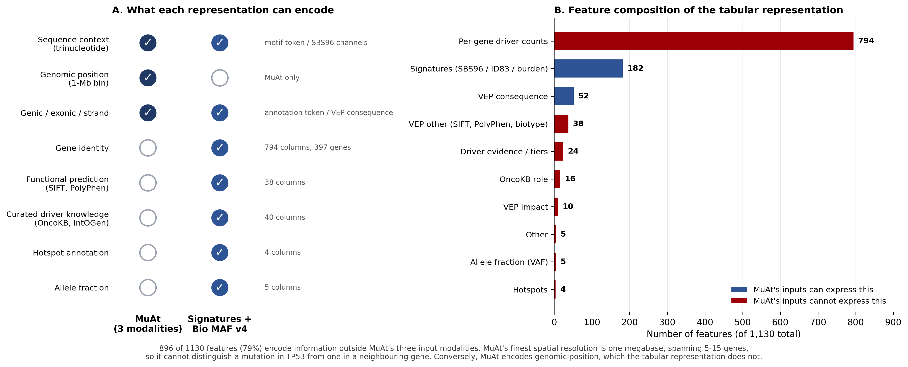

# Results Summary

**Vijay Vankadaru | 4 October 2026 | branch `codex/coxnet-muat-manuscript-updates`**

Supersedes `docs/results_summary_2026-08.md` (5 September). Everything in that document still
holds; this one adds the MuAt fidelity audit, the faithful fixed-architecture protocol, the fold 3
rerun, and the clarifications Aaron asked for on 2 October. Sections unchanged since September are
reproduced in full so this is the only file anyone needs to open.

All runs are complete as of 4 October.

**Contents**

1. [What is new since 5 September](#1-what-is-new-since-5-september)
2. [Main panel results](#2-main-panel-results)
3. [MuAt comparison](#3-muat-comparison)
4. [New analysis: survival vs cancer type](#4-new-analysis-survival-vs-cancer-type)
5. [New analysis: individual-feature selection](#5-new-analysis-individual-feature-selection)
6. [New analysis: SHAP attribution](#6-new-analysis-shap-attribution)
7. [New analysis: HRD shortcut ablation](#7-new-analysis-hrd-shortcut-ablation)
8. [Frozen models for external validation](#8-frozen-models-for-external-validation)
9. [Defects found and fixed](#9-defects-found-and-fixed)
10. [Reproducibility findings](#10-reproducibility-findings)
11. [Every experiment run](#11-every-experiment-run)
12. [Decisions needed](#12-decisions-needed)
13. [Files produced](#13-files-produced)

---

## 1. What is new since 5 September

| # | New work | Type |
|---|---|---|
| 1 | MuAt fidelity audit: our comparator checked line by line against the official MuAt trainer (`primasanjaya/muat`) | Audit |
| 2 | Faithful fixed-architecture MuAt protocol, cancer typing, all five folds complete | New result |
| 3 | Faithful fixed-architecture MuAt protocol, HRD endpoints, complete | New result |
| 4 | Fold 3 rerun under the original search protocol with a harness divergence guard, complete (v2; v1 failed, see 3.4) | New result |
| 5 | Gradient clipping evaluated and rejected: official MuAt does not clip | Audit |
| 6 | Four previously undocumented deviations from the official MuAt recipe identified | Audit |
| 7 | Clarification of arm C (0.504 / 0.703) vs the main-panel HRD row (0.519 / 0.729): same recipe, two trainings | Clarification |
| 8 | Fifth frozen model, `HRD_Score__standard_sbs96_id83`, for Cindy's external validation | New artefact |
| 9 | Canonical OOF prediction table added to the repository through Git LFS; stale manifest hashes corrected | Reproducibility |
| 10 | Divergence-guard unit tests replaying the two real fold-3 trajectories | Correctness |

---

## 2. Main panel results

Nested out-of-fold, five outer folds, pooled predictions. Best score per cell. Unchanged since
the 20 August clean rebuild (96 of 96 slots).

### 2.1 Summary, best learner per representation

| Endpoint | Metric | n | Burden | Signatures | Bio MAF v4 | Sigs + Bio MAF | Best |
|---|---|---|---|---|---|---|---|
| Kucab damage class | balanced acc | 259 | 0.178 | **0.331** | 0.293 | 0.204 | Signatures |
| HRD score | Spearman r | 772 | 0.600 | 0.693 | 0.741 | **0.767** | Combined |
| HRD24 high/low | AUROC | 772 | 0.775 | 0.829 | 0.832 | **0.848** | Combined |
| HRD33 high/low | AUROC | 772 | 0.799 | 0.850 | 0.856 | **0.901** | Combined |
| HRD42 high/low | AUROC | 772 | 0.838 | **0.902** | 0.875 | 0.897 | Signatures |
| Cancer type (top 20) | balanced acc | 8,800 | 0.255 | 0.538 | 0.662 | **0.738** | Combined |
| Overall survival | Harrell C | 9,986 | 0.584 | 0.607 | 0.634 | **0.650** | Combined |
| PFI | Harrell C | 9,857 | 0.555 | 0.570 | 0.622 | **0.630** | Combined |

> **Meaning.** No representation wins everywhere. Signatures win the mechanistic endpoint;
> combined signature + annotation features win tumour identity and HRD. The spread across
> representations far exceeds the spread across learners, which is the paper's central claim.

### 2.2 Full detail, by learner

| Endpoint | Representation | Linear | XGBoost |
|---|---|---|---|
| **damage_class** (bal. acc) | burden | 0.1783 | 0.1446 |
| | signatures | **0.3309** | 0.2500 |
| | Bio MAF v4 | 0.2934 | 0.1744 |
| | sigs + Bio MAF | 0.2042 | 0.1982 |
| **HRD_Score** (Spearman) | burden | 0.4973 | 0.5997 |
| | signatures | 0.4306 | 0.6927 |
| | Bio MAF v4 | 0.7144 | 0.7413 |
| | sigs + Bio MAF | 0.7325 | **0.7666** |
| **hrd_binary_24** (AUROC) | burden | 0.7504 | 0.7749 |
| | signatures | 0.7577 | 0.8292 |
| | Bio MAF v4 | 0.7805 | 0.8315 |
| | sigs + Bio MAF | 0.8112 | **0.8478** |
| **hrd_binary_33** (AUROC) | burden | 0.7884 | 0.7989 |
| | signatures | 0.7736 | 0.8496 |
| | Bio MAF v4 | 0.7691 | 0.8555 |
| | sigs + Bio MAF | 0.7965 | **0.9008** |
| **hrd_binary_42** (AUROC) | burden | 0.8245 | 0.8383 |
| | signatures | 0.8585 | **0.9024** |
| | Bio MAF v4 | 0.7911 | 0.8746 |
| | sigs + Bio MAF | 0.8245 | 0.8970 |
| **cancer_type_top20** (bal. acc) | burden | 0.2473 | 0.2549 |
| | signatures | 0.5263 | 0.5381 |
| | Bio MAF v4 | 0.5712 | 0.6618 |
| | sigs + Bio MAF | 0.6723 | **0.7378** |
| **OS** (Harrell C, CoxNet) | burden | 0.5838 | n/a |
| | signatures | 0.6069 | n/a |
| | Bio MAF v4 | 0.6335 | n/a |
| | sigs + Bio MAF | **0.6505** | n/a |
| **PFI** (Harrell C, CoxNet) | burden | 0.5552 | n/a |
| | signatures | 0.5697 | n/a |
| | Bio MAF v4 | 0.6220 | n/a |
| | sigs + Bio MAF | **0.6305** | n/a |

---

## 3. MuAt comparison

### 3.1 Two MuAt protocols now exist

| | Search protocol (20 Aug) | Faithful fixed-architecture protocol (2 to 3 Oct) |
|---|---|---|
| Architecture | per-fold search over 18 candidates (embed 128/256/512 x layers 1/2/4 x heads 1/2), ranked on 3 epochs | fixed 128-dim, 1 layer, 1 head (official reproduction recipes) |
| LR schedule | cosine annealing | constant (official default) |
| Weight decay | 0.0 | 0.001 (official `TrainerConfig` default) |
| Epoch selection | inner validation, patience 25, balanced accuracy | all 150 epochs, best validation accuracy (official `best_ckpt` rule) |
| Token grammar | legacy allele-string motifs (11,329 tokens) | MuAt symbolic three-base motifs, transcriptional strand (arm D grammar) |
| Gradient clipping | none | none |
| Common to both | SGD momentum 0.9, lr 6e-4, batch size 1, 150-epoch budget, 5,000-event cap, exact dictionaries, canonical outer folds shared with the tabular panel, nested inner split for selection | |

Every line of the faithful config carries a source tag (PAPER, CODE, LEDGER, OURS); see
`config/experiment_settings.muat_top20_faithful_fixed_arch.yaml` and
`docs/muat_fidelity_audit_2026-10.md`.

### 3.2 On MuAt's own benchmark: TCGA-WES, 20 tumour types, n = 8,800

| Model | Accuracy | Balanced acc | Top-5 | Macro F1 |
|---|---|---|---|---|
| **Signatures + Bio MAF v4 / XGBoost** | **0.744** | **0.738** | **0.955** | |
| MuAt, published (Sanjaya et al. 2023, PCAWG-pretrained, n = 7,352) | 0.641 | not reported | 0.906 | not reported |
| MuAt-compatible, search protocol, fold 3 diverged (20 Aug) | 0.570 | 0.550 | 0.871 | 0.553 |
| **MuAt-compatible, search protocol, fold 3 rerun v2 (4 Oct)** | **0.602** | **0.590** | **0.886** | **0.586** |
| **MuAt-compatible, faithful fixed architecture (3 Oct)** | **0.549** | **0.528** | **0.861** | **0.527** |
| MuAt-compatible, before the August fixes (July audit) | 0.539 | 0.534 | 0.861 | |

Faithful protocol per fold (accuracy): 0.570, 0.543, 0.544, 0.547, 0.538. Refit losses 0.24 to
0.78. No fold diverged.

Search protocol after the fold 3 rerun, per fold (balanced accuracy): 0.607, 0.601, **0.558**,
0.587, 0.598. Fold 3 selected the same 128-dim, 4-layer candidate as folds 1 and 2, stopped at
epoch 80, refit loss 0.011. The guard never had to trip; with the corrected rule the healthy
candidate simply survived its full-length pass.

> **Meaning.** With fold 3 repaired, the search protocol reaches 0.602 accuracy / 0.590 balanced,
> and the faithful protocol 0.549 / 0.528. The tabular model is at 0.744 / 0.738, so the gap to
> the best MuAt-compatible number is 0.14 accuracy under the most favourable protocol and 0.20
> under the faithful one. Both remain below the published MuAt figure (0.641), which used
> PCAWG-pretrained weights and more tumours. The six-point spread between the two protocols is the
> value of per-fold architecture tuning (the search picked 4 layers on three of five folds; the
> official recipe fixes 1). Fold 3 is unremarkable under both protocols (0.558 and 0.544), so the
> 20 August collapse was an artefact of one searched 256-dim, 4-layer candidate, not of the data
> split. The conclusion does not depend on which protocol is reported.

### 3.3 Fidelity ablation on the HRD endpoints

Search protocol, identical folds and seed. Each arm adds one fidelity fix.

| Arm | Change introduced | HRD_Score (Spearman) | HRD33 (AUROC) |
|---|---|---|---|
| A | as committed (training-budget bug, hashed dictionaries) | 0.4766 | 0.7582 |
| B | + epoch-budget fix | 0.5032 | 0.7274 |
| C | + exact token dictionaries | 0.5041 | 0.7028 |
| D | + MuAt-faithful motif grammar and transcriptional strand | 0.4815 | 0.7335 |
| main row | same recipe as C, retrained 20 Aug after fingerprint keys were added | 0.5194 | 0.7291 |
| faithful | fixed architecture, constant LR, wd 0.001, all epochs, arm D grammar (4 Oct) | **0.4836** | **0.7361** |
| | *tuned tabular baseline* | *0.7666* | *0.9008* |
| | **spread across arms A to D** | **0.028** | **0.055** |

> **On arm C vs the main row (Aaron, 2 Oct).** Both are correct. They are the same recipe trained
> twice: arm C on 11 July, the main row on 20 August after safety keys were added to the checkpoint
> fingerprint, which forced a retrain. Every recorded setting is identical (all 60 columns of the
> endpoint results were diffed; only the score and fingerprint differ). The gap, 0.015 Spearman and
> 0.026 AUROC, is run-to-run variation; fold-level Spearman in the 20 Aug run spans 0.50 to 0.62.
> Recommendation: keep 0.519 / 0.729 for the main MuAt row (current code and checkpoints) and leave
> the A to D paragraph as its own internally consistent set; or, now that the faithful HRD run is
> complete, report 0.484 / 0.736 and make the whole MuAt column one protocol (decision 2).

> **Meaning.** Six HRD runs spanning hashed to exact dictionaries, legacy to faithful grammar,
> searched to fixed architecture, and cosine to constant LR all land in 0.48 to 0.52 Spearman and
> 0.70 to 0.76 AUROC. Progressive fidelity fixes changed HRD performance by less than fold-to-fold
> variance and inconsistently in direction. The conclusion that a tuned tabular representation
> outperforms the mutation-attention model on HRD is not an artefact of an unfaithful
> reimplementation. HRD is data-limited (n = 772), not representation-limited.

### 3.4 Fold 3 rerun under the search protocol

The 20 August run's fold 3 picked a 256-dim, 4-layer candidate off a 3-epoch ranking; at full
budget it diverged (refit loss 1.658 vs 0.003 to 0.020 on the other folds; balanced accuracy
0.358 vs 0.587 to 0.607). Two stabilisation options were evaluated:

| Option | Decision | Reason |
|---|---|---|
| Gradient clipping | **rejected** | Official trainer exposes `grad_norm_clip` but defaults it to `None` and never sets it. Published MuAt does not clip. |
| Divergence guard in the architecture-search harness | **adopted** | Official MuAt has no search, so the guard has no counterpart to be unfaithful to. It excludes a candidate whose inner-pass loss explodes and falls back to the next-ranked one. It cannot alter any run in which no candidate diverges, so folds 1, 2, 4, 5 are reused byte for byte. |

**Attempt v1 (2 Oct, 7.2 h) failed.** The guard used a 3x ratio on training loss and misfired in
both directions: it killed the healthy winner (candidate 5, loss 0.0006 to 0.0019 at epoch 118,
validation 0.576) and then accepted the diverging fallback (candidate 11, the same 256/4/1
architecture, loss 1.55 to 2.67, validation at chance) because 20-class cross-entropy saturates
near ln 20 = 3.0 < 3 x 1.55. Fold 3 came out at 0.390, a second independent replicate of the 20
August divergence. Pooled 0.5565. **Not a valid stabilised result; kept on disk under
`*_fold3_rerun_*` for the record.**

**Attempt v2 (3 to 4 Oct, 7.1 h) succeeded.** The rule is now an additive margin of 0.5 nats
above the pass's own minimum loss, which separates the two logged trajectories by three orders of
magnitude (0.001 vs 1.1). `scripts/test_muat_divergence_guard.py` replays both as acceptance
tests. Candidate 5 (128 / 4 / 1) won the ranking, survived its full-length pass (best epoch 80,
validation 0.556, 105 epochs run), and refit cleanly (loss 0.011). Fold 3: **0.558** balanced
accuracy. Pooled: **0.602 accuracy / 0.590 balanced / 0.886 top-5**. Folds 1, 2, 4, 5 are the
20 August checkpoints, byte for byte. Output tag `*_fold3_rerun_v2_*`.

### 3.5 Why MuAt underperforms: input representation, not architecture



| Input | MuAt | Signatures + Bio MAF v4 |
|---|---|---|
| Unit of input | one row per mutation (variable-length bag) | one fixed vector per tumour |
| Sequence context | trinucleotide motif token | SBS96 / ID83 channels (182) |
| Genomic position | 1-Mb bin (3,116 tokens) | none |
| **Gene identity** | **none** | **794 columns, 397 genes** |
| Functional prediction (SIFT, PolyPhen, VEP impact) | none | 100 |
| Curated cancer-gene knowledge (OncoKB, IntOGen, hotspots) | none | 44 |
| Allele fraction | none | 5 |
| Genic / exonic / strand | 16 to 18 tokens | within VEP consequence |
| Aggregation | learned, via attention | pre-computed |

> **Meaning.** MuAt's finest spatial resolution is one megabase, spanning 5 to 15 genes, so it
> cannot distinguish "TP53 mutated" from "a neighbouring gene mutated". 84% of the Bio MAF v4
> feature space is per-gene, and SHAP confirms the model uses it. The claim is not "our model
> family is better" but "this representation encodes gene-level and curated biology that the
> attention model's inputs cannot express".

### 3.6 Model size

| Model | Parameters |
|---|---|
| MuAt, published (embed 512, 2 layers) | 28,458,520 |
| MuAt-compatible, embed 128 (selected on 4 of 5 folds under the search protocol; fixed in the faithful protocol) | 3,638,565 |

8.7x smaller. Under the search protocol the 3-epoch ranking systematically preferred the smallest
embedding; the faithful protocol fixes 128 by construction, matching the official reproduction
recipes.

### 3.7 Deviations from the official MuAt recipe

Found during the 2 October audit. The first four were present in every run before the faithful
protocol, including arm D. The faithful protocol removes all four.

| Deviation | Official | Ours (search protocol) | Removed in faithful protocol |
|---|---|---|---|
| LR schedule | constant | cosine | yes |
| Weight decay | 0.001 (2023 paper value unverifiable; checkpoints carry an empty trainer config) | 0.0 | yes |
| Early stopping | none, all epochs run | patience 25 | yes |
| Selection metric | validation accuracy | balanced accuracy | yes |
| Architecture | one fixed config | per-fold search | yes |
| Selection split | the test split itself (official ledger acknowledges this leak) | nested inner split | no, ours is stricter and matches the tabular panel |
| Training data | PCAWG whole genome, pretrained | TCGA exome, from scratch | no, unavoidable |
| SV / MEI | present | absent | no, not callable from WES |
| Ensembling | ten fold models summed | none | no, ours is stricter |

---

## 4. New analysis: survival vs cancer type

Requested by Jeya. Three CoxNet arms on TCGA CDR overall survival, identical outer folds,
cohort = survival and cancer type and Bio MAF v4, n = 9,986, 3,061 events.

| Arm | Features | C-index |
|---|---|---|
| Cancer type only (one-hot, 33 types) | 33 | **0.7416** |
| Bio MAF v4 only | 948 | 0.6377 |
| Cancer type + Bio MAF v4 | 981 | **0.7429** |

Paired bootstrap, 2,000 resamples:

| Comparison | Delta C-index | 95% CI | p |
|---|---|---|---|
| Bio MAF v4 vs cancer type | -0.1039 | [-0.1153, -0.0923] | 0.000 |
| **Cancer type + Bio MAF vs cancer type** | **+0.0013** | **[-0.0028, +0.0054]** | **0.512** |
| Cancer type + Bio MAF vs Bio MAF | +0.1052 | [+0.0952, +0.1150] | 0.000 |

> **Meaning.** Adding 948 genomic features to cancer type buys +0.0013 C-index. The interval
> excludes any effect above about 0.005, a precise null. Cancer type alone outperforms the genomic
> representation by 0.10. The survival endpoint is a negative control, as the manuscript now
> states.

---

## 5. New analysis: individual-feature selection

Jeya's protocol: 80/20 split, k-fold internal CV over six sparsity settings, select the sparsest
setting within tolerance of the best inner score, refit on the full training partition, evaluate
once on the held-out 20%.

| Endpoint | Features kept | Inner-CV (best) | Held-out |
|---|---|---|---|
| cancer_type_top20 | **347 / 948 (36.6%)** | 0.6490 (0.6490) | 0.6968 |
| Overall survival | **92 / 948 (9.7%)** | 0.6296 (0.6391) | 0.6108 |

> **Meaning.** For cancer type the selected setting matched the best inner-CV score exactly, a 63%
> reduction in feature count at zero measurable cost. For survival only 10% of features carry
> signal. Most of the 948-feature space is not contributing, which is the direct answer to the
> overfitting concern.

---

## 6. New analysis: SHAP attribution

Exact TreeSHAP via XGBoost `pred_contribs`, held-out samples only, aggregated to annotation blocks.

| Block | cancer_type_top20 | Overall survival |
|---|---|---|
| VEP consequence | **21.9%** | 16.2% |
| Per-gene driver counts | 19.9% | 8.3% |
| VEP impact | 15.2% | 2.6% |
| VEP other (SIFT, PolyPhen, biotype) | 13.1% | **20.6%** |
| OncoKB role | 8.6% | 18.1% |
| Allele fraction (VAF) | 6.4% | 12.3% |
| Hotspots | 6.3% | 0.9% |
| Driver evidence / tiers | 4.4% | 4.7% |
| Mutation type / burden | 2.8% | 5.9% |
| Other | 1.4% | 10.5% |

> **Meaning.** No annotation family exceeds 22% of total attribution. The model spreads weight
> across interpretable blocks rather than depending on one unstable feature. IDH1 ranks 5th by
> gain but 41st by mean |SHAP|, consistent with a feature decisive for a small subset (glioma)
> rather than broadly informative.

---

## 7. New analysis: HRD shortcut ablation

Same five outer folds across arms; paired bootstrap, 2,000 resamples. 32 per-gene columns removed
for 16 HRR genes; 14 VAF columns removed.

| Endpoint | Full | minus HRR genes | Delta (95% CI) | p | minus VAF | Delta (95% CI) | p |
|---|---|---|---|---|---|---|---|
| HRD_Score | 0.7604 | 0.7628 | +0.0023 [-0.007, +0.012] | 0.622 | 0.7468 | -0.0136 [-0.028, +0.001] | 0.072 |
| hrd_binary_24 | 0.8633 | 0.8514 | -0.0119 [-0.028, +0.006] | 0.180 | 0.8690 | +0.0057 [-0.003, +0.015] | 0.183 |
| hrd_binary_33 | 0.8995 | 0.8981 | -0.0014 [-0.007, +0.004] | 0.637 | 0.8742 | -0.0254 [-0.041, -0.010] | **0.000** |
| hrd_binary_42 | 0.8966 | 0.8976 | +0.0010 [-0.006, +0.008] | 0.725 | 0.9018 | +0.0052 [-0.003, +0.014] | 0.261 |

Genes removed: ABL1, ATM, ATR, BARD1, BRCA1, BRCA2, MDC1, NSD2, PALB2, PARP1, POLD1, POLE, PPP4R2,
RAD50, RAD51C, RAD52.

> **Meaning.** Removing every per-gene feature for the 16 HRD/HRR genes costs nothing on any
> endpoint. The HRD result is not a restatement of "a known homologous-recombination gene is
> mutated". VAF removal matters on one endpoint only (HRD33, -0.025).

---

## 8. Frozen models for external validation

Fitted on the full TCGA cohort and serialised. Five models.

| Model | Task | Features | n | CV score |
|---|---|---|---|---|
| `HRD_Score__signatures_plus_MAF_stack` | regression | 1,130 | 772 | 0.7722 Spearman |
| `HRD_Score__standard_sbs96_id83` | regression | 182 | 772 | 0.6919 Spearman |
| `cancer_type_top20__signatures_plus_MAF_stack` | 20-class | 1,130 | 8,800 | 0.7547 balanced acc |
| `cancer_type_top20__standard_sbs96_id83` | 20-class | 182 | 8,800 | 0.5500 balanced acc |
| `hrd_binary_33__signatures_plus_MAF_stack` | binary | 1,130 | 772 | 0.9045 AUROC |

The two `HRD_Score` rows are the paired comparison for external cohorts: the 182-feature
signature-only model loses about 0.08 Spearman relative to the 1,130-feature stack, the cost of
dropping the Bio MAF v4 annotation block.

**Canonical OOF prediction table.** `results/tables/main_manuscript_complete_panel_oof_predictions.csv`
is now in the repository through Git LFS: 57,960,349 bytes, SHA-256 `84d7472c...`, rebuilt 20
August. Two superseded copies are in circulation and must not be used: `bcf31b56...` (42.7 MB,
June pre-rebuild export, previously cited in the manifests and now corrected) and `f1c4bec3...`
(58.0 MB, the Hugging Face copy, one rebuild behind). See `results/frozen_models/README.md`.

> **Caveat for Methods.** These models are fitted on all of TCGA and have never been evaluated on
> held-out TCGA data; every manuscript metric comes from out-of-fold fold models. External results
> from a frozen model are a genuine out-of-sample test, but the model is a new artefact.

---

## 9. Defects found and fixed

| # | Defect | Consequence | Status |
|---|---|---|---|
| 1 | Attention pooling took the mask fill value from the wrong tensor's dtype | Raised on any GPU run; pooling had never completed a training step on a GPU | fixed (Jul) |
| 2 | Architecture-search epoch budget reused as the final training budget | Final model trained at most 3 epochs instead of 150 | fixed (Jul) |
| 3 | Token dictionaries hashed into fewer buckets than the vocabulary | About 96% of motif tokens collided | fixed (Jul, `dictionary_mode: exact`) |
| 4 | Event truncation sorted on a string chromosome column | Discarded chromosomes 3 to 9, X, Y in hypermutators | fixed (Jul, seeded subsample) |
| 5 | CoxNet fitted at a single alpha with no warm-start path | `ArithmeticError` on high-dimensional survival designs | fixed (Aug) |
| 6 | Fold-checkpoint fingerprint omitted the training protocol | A fixed rerun would silently reuse pre-fix checkpoints | fixed (Aug) |
| 7 | Table S3 written only when combinations were missing | A complete benchmark failed strict validation | fixed (Aug) |
| 8 | Divergence guard v1 used a loss ratio | Killed a healthy candidate at loss 1e-3; missed a real divergence capped by ln 20 | fixed (3 Oct, additive margin, unit-tested) |
| 9 | Compatible-checkpoint reuse compared a searched fold's selected architecture against the base settings | Could never match, so cross-fingerprint reuse was silently impossible for search runs | fixed (2 Oct) |
| 10 | Fold checkpoints keyed by endpoint and fold only | Two protocols for one endpoint would overwrite each other's checkpoints | fixed (2 Oct, `checkpoint_subdir`) |
| 11 | Manifests cited a June hash for the OOF table | Collaborators chased a file that no longer existed | fixed (18 Sep) |

---

## 10. Reproducibility findings

**Inputs absent from the Hugging Face bundle.** The CDR table was uploaded 15 August. Three
remain to be uploaded before submission:

| Missing input | Blocks |
|---|---|
| `COSMIC_v3.5_SBS_GRCh37.txt` | Kucab spectra (96 channels) |
| `COSMIC_v3.5_ID_GRCh37.txt` | Kucab spectra (83 channels) |
| `datasets/kucab_mendeley/raw_mutation_tables/` | Kucab damage_class |

`scripts/audit_bundle_inputs.py` checks every required input in about five seconds.

**The Hugging Face OOF table is stale** (see section 8). The repository copy is authoritative
until the dataset is refreshed.

**The 948-column feature table and the MC3 MAF are both available:**
`results/tables/quick_bio_v4_maf_features.csv.gz` in the repository (3 MB, since July), and
`github_exports_datasets/datasets/tcga_mc3/raw/mc3.v0.2.8.PUBLIC.maf.gz` on Hugging Face (753 MB).

**Windows path length.** Longest tracked path is 249 characters; `git config core.longpaths true`
is required to clone on Windows.

---

## 11. Every experiment run

| # | Experiment | Configuration | Scale | Runtime | Output | Status |
|---|---|---|---|---|---|---|
| 1 | Main panel, clean rebuild | `strict_no_leakage.yaml` | 96 slots, nested 5-fold | ~14 h | `main_manuscript_complete_panel_*` | done 20 Aug |
| 2 | Manuscript figures and tables | `make_all_figures` | 12 figures, 51 tables | ~7 min | `results/manuscript/` | done |
| 3 | MuAt arm A | `muat_ab_a_before.yaml` | HRD x2, 5 folds, 18 candidates | ~95 min | `..._ab_a_before_*` | done 11 Jul |
| 4 | MuAt arm B | `muat_ab_b_epochfix.yaml` | as above | ~95 min | `..._ab_b_epochfix_*` | done 11 Jul |
| 5 | MuAt arm C | `muat_ab_c_full.yaml` | as above | ~96 min | `..._ab_c_full_*` | done 11 Jul |
| 6 | MuAt arm D | `muat_ab_d_faithful.yaml` | as above | ~143 min | `..._ab_d_faithful_*` | done 17 Aug |
| 7 | MuAt HRD main row | `muat_main_endpoints.yaml` | HRD x2, retrain of arm C recipe | ~2 h | `..._main_endpoints_comparable_*` | done 20 Aug |
| 8 | MuAt tumour typing, search protocol | `muat_top20_comparable.yaml` | 8,800 samples, 20 classes, 5 folds | 26.5 h | `..._cancer_type_top20_comparable_*` | done 20 Aug, fold 3 diverged |
| 9 | MuAt tumour typing, fold 3 rerun v1 | `muat_top20_fold3_rerun.yaml` (ratio guard) | fold 3 only | 7.2 h | `..._fold3_rerun_*` | failed 3 Oct, guard misfired |
| 10 | **MuAt tumour typing, fold 3 rerun v2** | `muat_top20_fold3_rerun.yaml` (margin guard) | fold 3 only | 7.1 h | `..._fold3_rerun_v2_*` | **done 4 Oct** |
| 11 | **MuAt tumour typing, faithful fixed architecture** | `muat_top20_faithful_fixed_arch.yaml` | 8,800 samples, 5 folds, no search | 18.5 h | `..._cancer_type_top20_faithful_fixed_arch_*` | **done 3 Oct** |
| 12 | **MuAt HRD, faithful fixed architecture** | `muat_hrd_faithful_fixed_arch.yaml` | HRD x2, 5 folds, no search | 3.0 h | `..._hrd_faithful_fixed_arch_*` | **done 4 Oct** |
| 13 | Survival cancer-type baseline | `run_survival_cancer_type_baseline.py` | 3 arms, n=9,986, 2,000 bootstrap | ~45 min | `survival_cancer_type_baseline_*` | done |
| 14 | Feature selection, cancer type | `run_individual_feature_selection.py` | 6 settings x 5 folds | ~15 min | `feature_selection_cancer_type_top20_*` | done |
| 15 | Feature selection, OS | as above | as above | ~10 min | `feature_selection_OS_*` | done |
| 16 | SHAP attribution | within 14 and 15 | exact TreeSHAP | included | `..._shap_values.csv` | done |
| 17 | HRD shortcut ablation | `run_hrd_shortcut_ablation.py` | 4 endpoints x 3 arms | ~50 min | `hrd_shortcut_ablation_*` | done |
| 18 | Frozen models | `freeze_final_models.py` | 5 models | ~50 min | `results/frozen_models/` | done 18 Sep |
| 19 | Token grammar verification | `test_muat_tokens.py` | paper worked examples | seconds | console | passing |
| 20 | Divergence guard verification | `test_muat_divergence_guard.py` | 23 checks incl. real fold-3 trajectories | seconds | console | passing |
| 21 | Bundle input audit | `audit_bundle_inputs.py` | 15 required inputs | seconds | console | passing |

Total compute to date: roughly **105 hours**, of which MuAt tumour typing accounts for about 60.

---

## 12. Decisions needed

| # | Decision | Context | Recommendation |
|---|---|---|---|
| 1 | **Which MuAt protocol the main text reports for cancer typing** | 3.1, 3.2 | Faithful fixed architecture in the main text (verified against the official trainer, no fold diverged); search protocol in the supplement as the ablation it already is |
| 2 | **Whether the HRD column also moves to the faithful protocol** | 3.3 | Yes. Run 12 is clean (0.484 / 0.736, no fold diverged); the whole MuAt column becomes one protocol and the arm C vs main row question disappears |
| 3 | **Weight decay wording** | 3.7 | "0.001 per the official software; the 2023 value is not recoverable from the published checkpoints" |
| 4 | **Do not attribute attention-weighted pooling to MuAt** in Methods | 3.5 | The paper does not specify pooling; it is our design choice |
| 5 | **Pretrained weights**: state why they were not used | 3.7 | One sentence: PCAWG whole-genome token distributions do not match TCGA exome |
| 6 | **Fold pairing**: main-panel outer folds differ across representations | since Aug | State the limitation, or re-run paired |
| 7 | **Metastatic status** as a survival confounder | since 1 Aug | Methods or Limitations |
| 8 | **Refresh the Hugging Face OOF table** before submission | section 8 | One upload; needs a write token |

---

## 13. Files produced

**Result tables** (`results/tables/`)

| File | Contents |
|---|---|
| `main_manuscript_complete_panel_endpoint_results.csv` | 96 slots |
| `main_manuscript_complete_panel_oof_predictions.csv` | canonical split manifest (LFS) |
| `muat_style_tcga_comparator_cancer_type_top20_faithful_fixed_arch_*` | 3.2, faithful protocol |
| `muat_style_tcga_comparator_cancer_type_top20_comparable_fold3_rerun{,_v2}_*` | 3.4 |
| `muat_style_tcga_comparator_hrd_faithful_fixed_arch_*` | 3.3, faithful protocol |
| `muat_ablation_summary.csv` | 3.3 |
| `survival_cancer_type_baseline_{summary,comparisons}.csv` | 4 |
| `feature_selection_{cancer_type_top20,OS}_{grid,selected,shap_values}.csv` | 5, 6 |
| `hrd_shortcut_ablation_{summary,comparisons}.csv` | 7 |

**Configs** (`config/`)

| File | Purpose |
|---|---|
| `experiment_settings.muat_top20_faithful_fixed_arch.yaml` | faithful protocol, cancer typing, every line source-tagged |
| `experiment_settings.muat_hrd_faithful_fixed_arch.yaml` | faithful protocol, HRD |
| `experiment_settings.muat_top20_fold3_rerun.yaml` | search protocol, fold 3 rerun with harness guard |

**Documentation** (`docs/`)

| File | Purpose |
|---|---|
| `results_summary_2026-10.md` | This document |
| `muat_fidelity_audit_2026-10.md` | Setting-by-setting comparison against the official MuAt trainer, with sources |
| `results_summary_2026-08.md` | Previous summary, superseded |
| `CHANGELOG_vijay.md` | What changed in the code and why |
| `results/frozen_models/README.md` | Inference instructions, feature-parity constraint, canonical OOF hash |

**Scripts** (`scripts/`): `test_muat_divergence_guard.py` (new), plus all scripts listed in the
September summary.

---

## Reproducing everything

```bash
python scripts/audit_bundle_inputs.py
python src/run_all_experiments.py --config config/experiment_settings.strict_no_leakage.yaml --paths config/paths.yaml --datasets-dir <bundle>
python scripts/run_all_deliverables.py
python scripts/run_hrd_shortcut_ablation.py
python scripts/freeze_final_models.py --all
python scripts/make_new_analysis_figures.py
# MuAt, faithful protocol
python src/run_all_experiments.py --config config/experiment_settings.muat_top20_faithful_fixed_arch.yaml --paths config/paths.yaml --datasets-dir <bundle>
python src/run_all_experiments.py --config config/experiment_settings.muat_hrd_faithful_fixed_arch.yaml --paths config/paths.yaml --datasets-dir <bundle>
# Tests
python scripts/test_muat_tokens.py
python scripts/test_muat_divergence_guard.py
```
